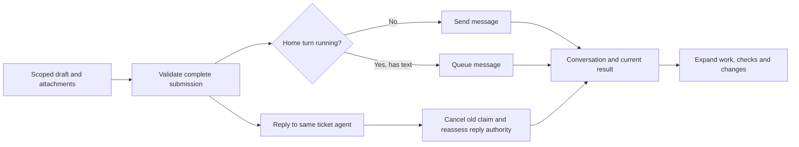

# Complete chat, composer and rendering direction

Source review: 2026-10-05. Neko baseline: `a22a41f`.

**Direction:** treat the composer, conversation and result as one experience.
Keep Neko's SwiftUI/AppKit shell and rich reply blocks. Give Home
and agent chats a shared, stable transcript model. Show the useful response first,
with intermediate work in an expandable row. Add real context lifecycle support
at the runtime boundary independently of that presentation work.

## Whole-chat follow-up, 2026-10-05

The original research below concentrated too heavily on compaction. The live
audit of the installed app at `a22a41f` confirmed a broader split: Home already
used a growing AppKit editor with attachments and commands, while each agent
had a basic SwiftUI text field. Agent results were hidden in Details underneath
large decision cards; old plans occupied the latest end of the conversation.

Two complete, buildable variants are in the existing
[Paper file](https://app.paper.design/file/01M3YBQPKND2A0GY02E3Z13H1G/p-1-0):
**20A · Complete chat — conversation first** and **20B · Complete chat — work log**.
Both preserve the native source-list sidebar and toolbar. A is the implementation
direction: user message, folded historical work, visible current result, shared
growing composer. B uses denser role-labelled work rows and a compact composer.
Illustrative review/check counts on these boards are sample content.

### Complete interaction contract

| Area | Direction and existing implementation seam |
| --- | --- |
| Drafting | Reuse `ComposerView` / `NSTextView` for both surfaces: undo, selection, bounded growth, Return to send, Shift Return for a line, IME composition preserved. |
| Draft lifetime | Keep drafts scoped to Home workspace/profile or ticket ID. Clear only the exact successful revision, including attachments; failed sends retain the draft. These stores are currently in-memory, not restart persistence. |
| Attachments | Reuse `ComposerAttachmentStore`, file picker, paste/drop, durable local references, removable chips. Validate serialized text including references against actual backend limits. |
| Sending | Home sends or queues; empty busy Home offers Stop. Return never means Stop. A ticket reply redirects the same agent through `ReplyToTask`; it is not a queued Home message. |
| Runtime | Home's catalog changes the app runtime. Agent chat can display that default; no UI should imply a per-ticket override or quota-based routing that the daemon does not support. |
| Reading | Keep the current result and review readable. Fold older plans, intermediate work and decision history when settled; keep needed questions and current approval plans visible. |
| Rich output | Wrap table cells, preserve escaped pipes, expose preview line counts and incremental expansion, copy complete available output. A UI cannot recover bytes already discarded by the daemon. |
| Following | Preserve explicit scroll-away and selection, with a clear route back to latest. A unified stable transcript/anchor model still needs dedicated work and long-conversation measurement. |
| Context | Only show measured occupancy and confirmed compaction events. No decorative context gauge or no-op `/compact` command. |

### Composer reference findings

- Zeron's composer has measured growth and explicit idle/send, busy/queue and
  busy-empty/stop states. Enter accepts a completion before sending, and never
  stops an empty running turn. Failed sends restore the draft without replacing
  newly added attachments. See
  [composer](https://github.com/zeronsh/zeron/blob/9b3773082a8171cd29387b07f2a2b92a48c6ad0b/crates/ui/src/composer.rs#L564)
  and [queue capabilities](https://github.com/zeronsh/zeron/blob/9b3773082a8171cd29387b07f2a2b92a48c6ad0b/crates/ui/src/queue.rs#L97).
- Macai's AppKit editor and attachment lifecycle are the closer native reference:
  loading, preview, removal and failure belong in the composer, with a readiness
  gate before send. See
  [MacaiTextField](https://github.com/Renset/macai/blob/99300f753172e82bae0d70919c16897b2fea9a5b/macai/UI/Components/MacaiTextField.swift#L177)
  and [MessageInputView](https://github.com/Renset/macai/blob/99300f753172e82bae0d70919c16897b2fea9a5b/macai/UI/Chat/BottomContainer/MessageInputView.swift#L640).
- Zeron clamps effort to the selected model's supported options. Neko should
  derive options from its own catalog before adding effort UI. A local/new-worktree
  mode is verified in Zeron; a separate Ask/Plan mode was not established by this audit.

The reference findings are source inspections, not proof of their current installed
apps. Implementation here reuses Neko's own components; no renderer or new package
was imported. The original staged roadmap below remains the deeper backend and
performance work, not a claim that this first UI pass completes it.

## What the references actually do

| Reference | Useful mechanism | Limits of the comparison |
| --- | --- | --- |
| [Zeron](https://github.com/zeronsh/zeron/tree/9b3773082a8171cd29387b07f2a2b92a48c6ad0b) | Native Codex compaction command, measured context occupancy, optional compact transcript mode, stable block rows and incremental Markdown. | Desktop is Rust/GPUI, not SwiftUI. Its compact transcript mode defaults off. Borrow the behavior and architecture, not its renderer. |
| [Enchanted](https://github.com/gluonfield/enchanted/tree/dc9bff882411a1317ff0cc5869de7e0515897df0) | SwiftUI chat with MarkdownUI, custom code blocks, tables, selection and buffered streaming. | Its inspected list scrolls to the bottom on every last-message content change. That policy would regress reading earlier content in Neko. No semantic context compaction found in the inspected path. |
| [Macai](https://github.com/Renset/macai/tree/99300f753172e82bae0d70919c16897b2fea9a5b) | SwiftUI/AppKit chat; wrapping table cells, TSV/JSON copying, collapsible reasoning with duration, scroll-away handling. | Context construction uses a suffix by message count, not a summary. Optional HTML previews use WKWebView; normal chat blocks are native. |
| [Agent Sessions](https://github.com/jazzyalex/agent-sessions/tree/bfa67f3dd8a4fd9b84a8caf27d6bff820da6a08b) | SwiftUI/AppKit transcript viewer with NSTableView incremental updates, scroll anchors, NSTextTable and a cross-message selection coordinator. | Older local reference snapshot, not a freshly fetched release. A viewer reference, not an agent execution/compaction reference. Some wholesale updates clear selection. |

These were inspected as source. No external app was installed or run. Zeron's
repository screenshot and context-meter fixture, and Enchanted's promotional
image, were viewed; they are not live acceptance evidence for this proposal.
Zeron and Agent Sessions are MIT; Enchanted and Macai are Apache-2.0. Follow
Neko's reference rule: study patterns and write Neko's own implementation.

## Three different meanings of compaction

**Model context compaction.** Zeron maps `/compact` to Codex app-server
`thread/compact/start`, requires an existing conversation, rejects unsupported
arguments and attachment combinations, and reports `Context compacted.` on a
completed `contextCompaction` item. The provider performs the compaction; the
UI does not manufacture a summary and pretend the runtime accepted it.
[Command mapping](https://github.com/zeronsh/zeron/blob/9b3773082a8171cd29387b07f2a2b92a48c6ad0b/crates/harness/src/codex/mod.rs#L874).

**Visual folding.** Its optional compact mode folds tools, exposed reasoning
and intermediate narration into one turn accordion while leaving the trailing
final response visible. During an active turn it keeps work inside the accordion.
This changes presentation, not model memory.
[Turn projection](https://github.com/zeronsh/zeron/blob/9b3773082a8171cd29387b07f2a2b92a48c6ad0b/crates/ui/src/transcript.rs#L1285).

**Storage/output shortening.** Tool output in Zeron's session document has a
160-character summary policy; its source notes that full text survives in the
host journal while the documented sidecar path is parked. That is a separate
retention decision. Neko should not mistake a short visible preview for a
complete, recoverable command receipt.
[Output summary policy](https://github.com/zeronsh/zeron/blob/9b3773082a8171cd29387b07f2a2b92a48c6ad0b/crates/doc/src/parts.rs#L11).

Zeron's context ring uses the latest model call and reported capacity, separately
from cumulative billing. Missing measurements appear unavailable, not 0%.
[Normalization](https://github.com/zeronsh/zeron/blob/9b3773082a8171cd29387b07f2a2b92a48c6ad0b/crates/harness/src/codex/normalize.rs#L140)
and [cross-provider contract](https://github.com/zeronsh/zeron/blob/9b3773082a8171cd29387b07f2a2b92a48c6ad0b/docs/context-usage.md).

## Baseline gaps, in priority order

These describe the inspected `a22a41f` baseline. The follow-up fixes visible
results, shared composing, explicit Home scroll intent and local rich-output
previews. The underlying continuity, streaming, transcript identity and event
retention work below remains open; see the evidence report for the exact boundary.

1. **Home continuity:** `crates/neko-core/src/neko_chat.rs:575` selects the last
   12 messages before workspace/profile filtering and truncates each included
   message to 1,000 bytes. Busy conversations in other scopes can crowd out the
   relevant history. Fix filter-before-window ordering first. This is lossy
   prompt construction, not semantic compaction. Tickets already resume Codex
   sessions; Home needs an explicit durable-session or scoped-summary strategy.
2. **Final answers are buried:** `TicketsView.swift:372` places results inside
   collapsed Details while the plan remains a separate visible section. Derive
   typed turns from message/run identities; keep the final outcome and a needed
   question visible, and fold intermediate activity together. Preserve the
   existing authority and review state separately from display text.
3. **Whole-message rendering:** `RichText.swift:139` reparses the full source in
   `body` and uses array offsets as block IDs. Home also discards runner progress
   callbacks at `crates/neko-daemon/src/workbench.rs:1314`. Preserve typed progress
   and separate final structured reply extraction before claiming streaming.
   Cache completed blocks and update a stable mutable tail.
4. **Long-chat interaction:** Home is lazy per message, but individual Markdown
   blocks and ticket rows are eager. `TodayView.swift:55` ignores scroll-away
   during a 1.2-second post-send pin. Use stable lazy block rows; explicit user
   scrolling/selection should detach following immediately. Preserve the visible
   anchor when expanding work and offer Jump to latest.
5. **Recoverable rich output:** table parsing mishandles escaped pipes and table
   cells use a one-line limit. Diff and terminal views show only the first
   400/300 lines. `workbench.rs:822` caps event messages at 2,048 bytes after
   serialization, which can invalidate JSON receipts; `TicketThread.swift:43`
   falls back to an empty command on decode failure. Budget fields before JSON
   serialization, expose truncation explicitly, and make full available content
   accessible through expand/copy. Retained-history limits need visible states.

The Swift paths above are under `native/NekoKit/Sources/NekoNative/`; the last
`workbench.rs` reference is in `crates/neko-core/src/`.

## Rendering direction and buildable alternatives

**A — calm conversation, recommended.** User message → one current work row →
final answer. Expanding the work row reveals chronological tool steps and any
runtime-exposed reasoning summaries. Errors, approval requests and unresolved
questions remain visible. The native top toolbar and composer stay in place.
Tables wrap; wide tables and code scroll horizontally; code has language/copy
controls; long output has an explicit expansion control.

**B — visible activity timeline.** Keep intermediate assistant updates and tool
groups in the conversation, with individual disclosure controls. It gives a
developer more continuous detail but costs vertical space and makes completed
answers harder to scan. Both variants should use the same stored data and row
model; this can become a presentation preference without duplicating renderers.

Use a shared SwiftUI transcript backed by stable turn/block IDs first. Reuse
`ReadableText`, `NativeTableBlock`, `NativeDiffBlock`, `NativeTerminalBlock`,
custom reply views, and `ChatScrollFollowState` after fixing its input semantics.
The parser and render projection belong outside view-body evaluation.

Zeron's current parser reparses the last **two** top-level blocks to handle
continuation merges; link-reference definitions force a full parse. Its
display-only repair of unfinished Markdown preserves canonical source.
Those correctness cases matter more than copying an incremental algorithm.
[Parser](https://github.com/zeronsh/zeron/blob/9b3773082a8171cd29387b07f2a2b92a48c6ad0b/crates/markdown/src/parser.rs#L978),
[stream repair](https://github.com/zeronsh/zeron/blob/9b3773082a8171cd29387b07f2a2b92a48c6ad0b/crates/markdown/src/mend.rs#L1).

For parsing, evaluate a standards-based Markdown AST against Neko's custom
reply fences before choosing a dependency. Enchanted's
[Markdown styling](https://github.com/gluonfield/enchanted/blob/dc9bff882411a1317ff0cc5869de7e0515897df0/Enchanted/UI/Shared/Chat/Components/ChatMessages/MarkdownColours.swift#L133)
is a good component boundary. No dependency was added in this research.

If cross-block selection or measured long-chat performance cannot meet the
acceptance checks in SwiftUI, host an AppKit transcript inside that same shell.
Agent Sessions demonstrates the
[incremental list](https://github.com/jazzyalex/agent-sessions/blob/bfa67f3dd8a4fd9b84a8caf27d6bff820da6a08b/AgentSessions/Views/TranscriptBlockListView.swift#L1192)
and [selection coordinator](https://github.com/jazzyalex/agent-sessions/blob/bfa67f3dd8a4fd9b84a8caf27d6bff820da6a08b/AgentSessions/Views/TranscriptSelectionCoordinator.swift#L22).
This is the heavier alternative, with more accessibility/layout integration work.

## Implementation order and acceptance

1. **Correctness slice — estimated 60–90 minutes:** scoped Home history window,
   valid bounded receipts and explicit output-limit indicators. Tests must cover
   interleaved workspaces/profiles, Unicode/oversized JSON and failure receipts.
2. **Transcript slice — estimated 3–5 hours:** shared turn projection, visible
   final answer, compact/expanded presentation, stable rows and correct scroll
   intent. Verify real mouse selection, disclosure, keyboard access and scrolling
   on macOS with short and long populated conversations.
3. **Rich rendering/streaming — estimated 4–8 hours:** typed progress delivery,
   cached parsing, table/code behavior and display-only incomplete Markdown.
   Use deterministic streams for partial fences, escaped pipes, long tables and
   repeated earlier-block updates. Profile a 1,000-turn fixture and one very long
   answer; retain measured frame/parse results rather than assuming parity.
4. **Real compaction — estimate 1–2 days after choosing Home session ownership:**
   reuse the app-server transport patterns in `agent_catalog.rs`, preserve ticket
   session identities and current execution authority, expose measured context
   and confirmed lifecycle events. A supported runtime may compact automatically;
   unsupported ones should state that capability honestly. Verify one actual
   resumed conversation across compaction, cancellation and restart.

These are estimates for the deeper work, not completed capabilities. The original
`6a467cd` commit contained research only. The follow-up UI implementation is recorded
in `docs/evidence/chat-composer-upgrade.md`. Compaction and long-conversation
performance have not been exercised against live providers.
