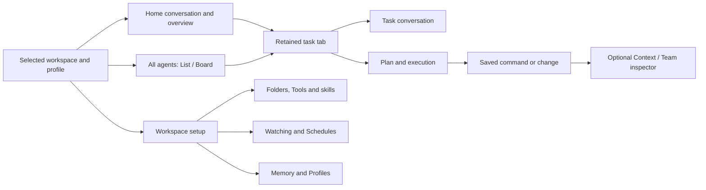
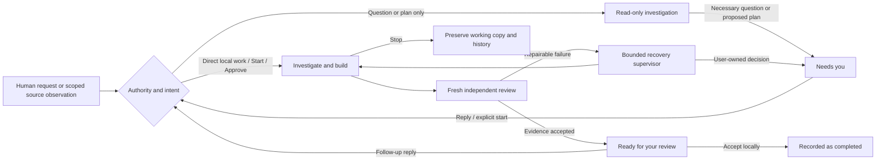

# Neko: Orbit reference and native direction

Review **B · Execution workspace** on [Neko · Orbit redesign](https://app.paper.design/file/01M3YBQPKND2A0GY02E3Z13H1G/p-3-0), then compare **A · Focused conversation**.

Status: design proposal, 2026-10-06. No production Swift/Rust code changed. No daemon restart or installation. The reference audit used the public [Orbit demo](https://orbit-agent-workspace.vercel.app/), which calls its visible workspace Aurora.

## What the reference gets right

Orbit makes ongoing work legible. A persistent source list anchors the workspace; resource tabs keep a task, conversation and file close together. Task plans lead into a chronological execution log. Evidence expands where it was produced. An optional inspector answers who is working and which context is attached. “Needs you” rows name a specific decision instead of presenting a generic stopped badge.

Its small expressive characters give the interface life without making the main content decorative. Neko can use its existing pointer-driven pearl for that personality. Task identities and status must remain textual and accessible; animation is supplementary.

**The demo is not a functioning agent harness.** Its public application source is a single inline HTML/CSS/JavaScript page with in-memory simulation. It has no application backend, model requests, real shell, deployment, permissions engine or durable conversation storage. Clipboard copy is the one explicit external application effect in the inspected script. Its fictional tools, durations, token counts, results and permissions are presentation fixtures.

## Reference deliverables

- [Orbit · Reference atlas in Paper](https://app.paper.design/file/01M3YBQPKND2A0GY02E3Z13H1G/p-4-0): unchanged browser screenshots and action/result captions.
- [Capture index](../evidence/orbit-reference-2026-10-06/capture-index.md): 161 screenshots, corresponding DOM snapshots and exact actions.
- [Source behavior map](../evidence/orbit-reference-2026-10-06/source-behavior-map.md): every navigation destination, menu family, scene, fixed role and source-level action.
- [Native capability map](../evidence/orbit-reference-2026-10-06/native-capability-map.md): current Neko routes, command adapters and buildability boundaries, with source citations.

## Two native directions

| Direction | Default emphasis | Useful tradeoff |
| --- | --- | --- |
| **A · Focused conversation** | One spacious reading lane; result and reply are central; inspector is optional. | Calmer for discussion and decisions. Plan/evidence requires disclosure or selection. |
| **B · Execution workspace** | Home overview; task plan and execution beside a compact conversation; resource/Team inspector and saved-output panel. | Closest to Orbit and stronger for overseeing work. Optional panes must collapse before the reading area becomes cramped. |

**Recommendation: B as the workspace direction, with A's spacious conversation treatment when the window narrows or the person is discussing a result.** This is one adaptable native layout, not a new mode that changes worker authority. Its tabs and pane state are new UI work over the existing backend. Do not treat the static Paper screens as a shipped feature or as a real Liquid Glass rendering.

Both directions preserve a native source-list sidebar and actual titlebar safe area. They use system typography and a neutral dark content surface. Native glass belongs on controls, with an opaque evidence surface and platform accessibility fallbacks. The rejected dock stays absent. Composer help does not add another always-visible “Return to send” line.

## Navigation map

The sidebar continues to expose Home, All agents and bounded live groups. Existing management pages remain reachable: Workspaces, Watching, Schedules, Tools & skills, Memory, Profiles, Design lab and Settings. The redesign is not permission to remove routes or replace them with inert overview cards.

Tabs identify Home, a ticket, or a saved task resource. They need a retained collection and stable selection in navigation-owned state. Closing a tab must preserve the existing scoped draft semantics. App-restart restoration is a separate capability; current Neko drafts survive navigation only.

## Task flow

The existing daemon determines eligibility, scope, state, recovery and review. The layout presents those facts. It must not introduce Orbit's fixed role occupancy limit, pretend arbitrary steps are separate agents, or change the publication boundary. Team membership comes from distinct existing child ticket IDs in approved splits. A builder, reviewer and recovery phase of one ticket are not three teammates.

## Page-by-page parity contract

| Surface | Native redesign | Existing backing / new work |
| --- | --- | --- |
| Home | Expressive but restrained pearl, outcome composer, live work and attention rows. | Reuse TodayView, shared composer, task snapshot and scoped Home adapters. Overview is new composition. |
| All agents | List/Board with clear text status, last meaningful activity and retained search/filter. | Reuse TicketsView and guarded start/cancel/complete transitions. No arbitrary drag to daemon-owned states. |
| Task | Stable task identity, plan, timeline, current result, scoped follow-up. | Reuse TicketThread, task result/readback and ReplyToTask. Layout and retained tabs are new. |
| Evidence | Select command or change; show owner/attempt, exit code, saved output and completeness. | Reuse receipts and TaskChanges. It is not an interactive terminal or full execution journal. |
| Context / Team | Selected resource, workspace/folder, model preference and approved child tasks. | Existing state in a new mounted composition. File inspection does not imply a universal editor. |
| Workspaces | Folder/tool/watch context in the same shell. | Existing workspace editor and saved folder targeting; “Sync now” remains a watch wake, not Git sync. |
| Watching / Schedules | Reuse calm table/editor hierarchy; expose actual due/result state. | Existing responsibility/schedule adapters. A scheduled planning ticket is not implicit build authorization. |
| Tools & skills | Native list and scoped connection detail; retain trust, sign-in, discover, enable/pause and instruction review. | Existing user-owned MCP/skills adapters. No default service connector or automatic marketplace install. |
| Memory / Profiles | Contextual guidance and identity, with source/scope visible. | Existing stores and commands. Profiles are not a running-agent roster; memory does not grant authority. |
| Settings | Preserve General/AI/Search/Permissions/Diagnostics and native appearance. | Existing settings, runtime discovery/validation and platform controls. No invented quota-aware failover. |

## Controls that must remain honest

| Orbit behavior | Neko treatment |
| --- | --- |
| Permanent cast of seven named specialists | Real task identities and approved child membership. A decorative character does not create a worker. |
| Global three-choice model menu, fixed role models | Real provider catalog; model/effort/speed controls with per-conversation pins and supported capability validation. |
| Context menu selections that do nothing | Real attachments/context references, visible selected state and removable chips. |
| Fake command prompt / Output / Problems notices | Saved evidence panel with clear completeness and no shell input unless a real terminal capability is separately built. |
| Cosmetic Pause / Cancel / Sign out | Existing guarded Stop and task actions, with acknowledgement/failure states. |
| Mock deploy-token grant | Real scoped tool/connection authority only. Never emulate a successful permission change from a toast. |
| Headline approval after a simulated deploy | Respect Neko's actual authority and review contract; no automatic publication. |
| Blank historic task tabs / inert resources | Loading, unavailable, empty or explicit unsupported state; never an unlabelled blank detail. |
| Random token counter and scripted durations | Show measured or saved values only, and distinguish requested service tier from the tier actually served. |

## Shared interaction and state acceptance

1. **Navigation and typing:** stableSplitPane, top safe area and real toolbar hit regions survive. Draft/attachment state is navigation-owned, scoped and revision-safe. Return sends; stop is explicit. Frequent snapshots do not replace editor identity or disrupt selection/IME composition.
2. **Work states:** empty, queued/dependency wait, planning, building, reviewing, necessary question, ready for review, failed/interrupted and stopped all have clear next actions. Worker updates retain the selected task/resource and reading position.
3. **Evidence:** current-versus-earlier-attempt context is visible. Missing, damaged, shortened and incomplete receipts never masquerade as complete successful proof. Accept locally records completion and does not merge/apply/publish changes.
4. **Window and access:** collapse Context first, then use a selectable conversation/evidence pane before text becomes too narrow. Verify native light/dark, Larger Text, VoiceOver, keyboard navigation, Reduce Motion, Reduce Transparency and Increased Contrast.
5. **Material and motion:** keep content readable/opaque; use system glass on controls. Existing pointer-driven pearl has no idle timer. Saved screenshots cannot establish animation feel, typing latency or native material behavior.

## Implementation sequence after direction selection

| Slice | Concrete boundary | Verification |
| --- | --- | --- |
| 1. Native shell and retained tabs | Add typed tab identity and pane selection around existing destinations, preserving drafts and filters. | Native navigation/typing, tab close/reopen, workspace switching, toolbar clicks and minimum-width behavior. |
| 2. Task composition | Recompose existing plan, conversation, outcome and evidence; add optional Context/Team and saved-output view. | Real queued, running, question, review and failure tickets; stopped work preserved; no false team counts. |
| 3. Home and All agents | Outcome composer, real attention rows and calm list/board hierarchy. | Empty/populated/blocked states, real search/filter, guarded actions and responsive layout. |
| 4. Management parity | Apply shared hierarchy to Tools, Workspaces, Watching, Schedules, Memory, Profiles and Settings. | Each existing action reaches its real adapter; no inert controls or lost management capability. |

Do not combine this visual redesign with a new scheduler, autonomous publication policy, plugin marketplace or worktree-deletion policy. Those are separate capabilities. Each implementation slice should be checked in the running native app, committed and installed only after confirming that no ticket is Planning, Building or Reviewing.

## Verification boundary for this deliverable

The browser audit verifies visible demo interactions and captured states. The source map explains scripted/no-op behavior. The native map verifies current source/command seams. Paper screenshots verify static composition, hierarchy, spacing, contrast and fit. None of these is proof of live Neko interaction, real Liquid Glass, production execution or provider compatibility. Swift/Rust tests were not rerun for this design-only change.
