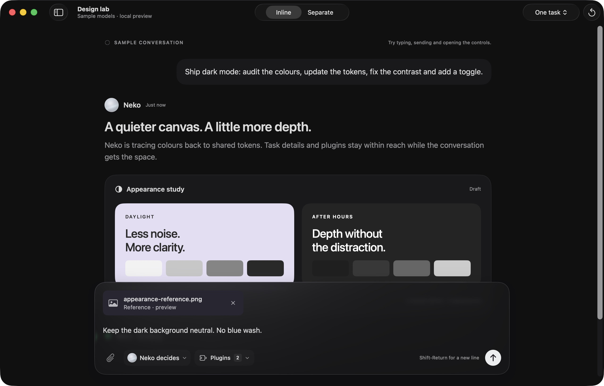
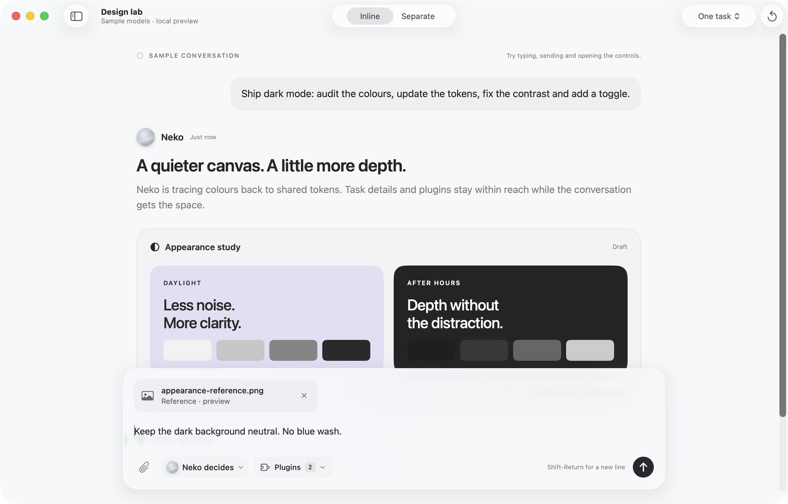

# Native glass visual styling · installed verification

Date: 2026-10-06. Reference: [02 · Native glass](../design/orbit-visual-style.md), selected from the visual-only Paper comparison. Existing Neko navigation and behavior are retained.

Installed source: `7fec3e9adae43cb913de44bd5ed60f9bd92f8728` on `main` (`f44ab15` contains the component styling; `7fec3e9` removes a redundant glass container found during native QA). Host: macOS 26.5.1. One canonical `/Applications/Neko.app` client and one bundled daemon were running after installation.

## What changed

The shared surface ramp has a neutral near-black dark canvas and readable secondary text. Home and ticket conversations use 24pt message gaps, 8pt author/body gaps and 16pt message insets. Shared composers have real native glass, 18pt padding, two-line attachment chips, a paperclip and a circular primary action. Send, Queue and Stop retain their existing dispatch, enabled states and accessibility labels. Board cards keep an opaque base during hover. Native sidebar, toolbar, safe area, page widths and navigation remain in place.

Reduce Transparency and Increased Contrast choose an opaque composer background. The conditional is confined to the background so that it does not recreate the live editor. This path was source-reviewed, not verified by changing macOS accessibility settings in this pass.

## Verification

| Check | Result and boundary |
| --- | --- |
| Swift tests | Baseline, styling and glass-layer correction each passed: 131 XCTest cases with zero failures; Swift Testing reported 11 tests passed. The optional `realDaemonPersistsNativeProtocolCommands` test was skipped because `NEKO_TEST_DAEMON` was not set. Existing composer dispatch, draft, sizing and IME coverage ran. |
| Independent source review | No actionable findings in either the original eight-file styling diff or the later wrapper removal. Reviewer did not run the UI or tests. |
| Release and installation | Release daemon and SwiftUI client built; Metal shader compiled; Apple Development signing and `codesign --verify --deep --strict` passed. Both installs followed a fresh read-only Snapshot with zero Planning/Building/Reviewing tasks and zero pending/queued Home messages. Data and credentials were preserved. Launch Services printed recoverable `-10814` unregister warnings; the installer exited successfully and the canonical bundle launched. |
| Production UI | Home and a completed agent chat accepted unsent multiline text; Shift-Return inserted a line. Home selection/replacement worked. Each draft survived navigation and stayed separate from the other chat; test text was cleared. The Home model/effort/speed popover exposed its controls. List/Board switching and both task treatments were inspected on screen. No real message was sent and no agent was started. |
| Sample UI | Inline and Separate rendered clearly; attachment removal/re-addition and Return-to-send worked locally. The sample cleared the submitted draft and disabled Send when empty. Light/dark screenshots were captured from the installed app. System appearance was restored; the user's selected agent remained open. |

The client and daemon SHA-256 hashes matched the signed build output:

```text
neko         b95273a09b2717123cc501f6573b84b354276590e94a34b8f0ca9fdc3a904bb1
neko-daemon  06562799b4dea66efa443bdac88f1f71f444c1964a6dfa91330f8bcb19bafc64
```

No Rust source changed, so Rust tests were not rerun. These checks do not establish sustained typing latency, live model behavior, old-macOS material rendering, pointer hover, divider dragging, or runtime accessibility transitions. The native screen service briefly failed while the user interacted with the app; it recovered, and readback confirmed the final appearance was `system`.

## Rendering defect caught by the native check

The first installed Design lab composer blurred its own foreground text and controls. Home and ticket composers did not. Design lab alone wrapped its single background glass surface in `GlassGroup`/`GlassEffectContainer`. Removing only that redundant wrapper restored sharp foreground content while retaining the blur behind the composer. The same installed screen was checked again in Inline and Separate, with light and dark appearance checks.

[Before: redundant container obscuring controls](native-glass-visual-style-2026-10-06/before-redundant-glass-container.jpg).

## Native captures

These are unedited 2560×1640 native window captures. The sidebar was temporarily collapsed to keep real task titles out of committed evidence. Design lab content is labelled sample content; its moodboard is an existing preview artifact, not a new product screen.





```text
before-redundant-glass-container.jpg  2d745ca06d920048cd7e37b85d7b782dfb45af0e0b0ca9ab7e75bed8705f36a7
dark-native.jpg                      9373941e556f803048bc747f4e8d05cd06e889b0c3018cdf24f44ac32ef8446a
light-native.jpg                     eab5f34ae904bf1316c29f6e5c539207829b9a2d0b252ac73c261196d74e1df4
```
